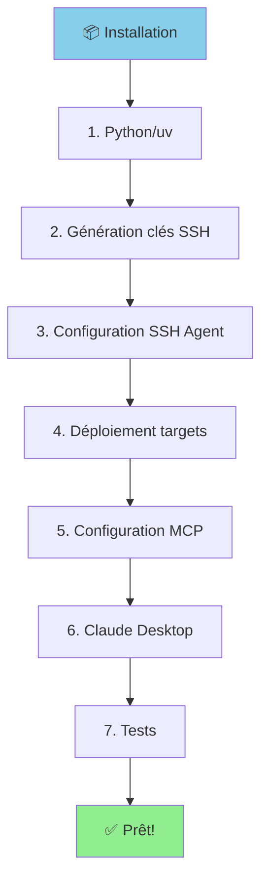
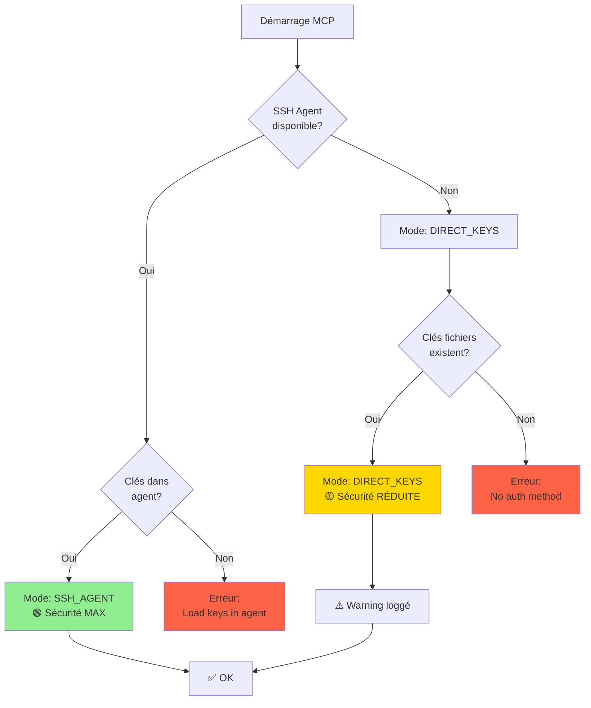

# Installation Guidée - MCP Linux Infra

## Vue d'Ensemble



## Étape 1: Prerequisites

### Windows 10/11

```powershell
# Vérifier Python 3.11+
python --version
# Si manquant: https://www.python.org/downloads/

# Installer uv
powershell -c "irm https://astral.sh/uv/install.ps1 | iex"

# Vérifier
uv --version
```

### OpenSSH (Windows)

```powershell
# Vérifier si OpenSSH est installé
Get-WindowsCapability -Online | Where-Object Name -like 'OpenSSH*'

# Si manquant, installer
Add-WindowsCapability -Online -Name OpenSSH.Client~~~~0.0.1.0

# Activer SSH Agent service
Set-Service ssh-agent -StartupType Automatic
Start-Service ssh-agent

# Vérifier
Get-Service ssh-agent
# Status: Running ✅
```

## Étape 2: Cloner/Setup Projet

```powershell
# Naviguer vers répertoire MCP servers
cd D:\infra\mcp-servers

# Si besoin de créer la structure
mkdir mcp-linux-infra
cd mcp-linux-infra

# Copier tous les fichiers du projet ici
# (structure complète créée précédemment)

# Installer dépendances
uv sync
```

## Étape 3: Générer Clés SSH

```powershell
cd D:\infra\mcp-servers\mcp-linux-infra

# Créer répertoire keys
mkdir keys
cd keys

# Clé read-only (diagnostics)
ssh-keygen -t ed25519 -f mcp-reader.key -C "mcp-reader@infra-$(Get-Date -Format 'yyyyMMdd')" -N '""'

# Clé PRA (actions)
ssh-keygen -t ed25519 -f pra-exec.key -C "pra-runner@infra-$(Get-Date -Format 'yyyyMMdd')" -N '""'

# Vérifier
ls *.key, *.pub
```

**Résultat attendu:**
```
Mode                 LastWriteTime         Length Name
----                 -------------         ------ ----
-a----        12/01/2026     10:30            464 mcp-reader.key
-a----        12/01/2026     10:30            109 mcp-reader.key.pub
-a----        12/01/2026     10:30            464 pra-exec.key
-a----        12/01/2026     10:30            109 pra-exec.key.pub
```

## Étape 4: Charger Clés dans SSH Agent

### Option A: SSH Agent (Recommandé)

```powershell
# Charger clés
ssh-add D:\infra\mcp-servers\mcp-linux-infra\keys\mcp-reader.key
ssh-add D:\infra\mcp-servers\mcp-linux-infra\keys\pra-exec.key

# Vérifier
ssh-add -l
```

**Résultat attendu:**
```
256 SHA256:abc123... mcp-reader@infra-20260112 (ED25519)
256 SHA256:def456... pra-runner@infra-20260112 (ED25519)
```

**Avec timeout (sécurité renforcée):**
```powershell
# Auto-suppression après 1 heure
ssh-add -t 3600 D:\infra\mcp-servers\mcp-linux-infra\keys\mcp-reader.key
ssh-add -t 1800 D:\infra\mcp-servers\mcp-linux-infra\keys\pra-exec.key
```

### Option B: Clés Directes (Fallback)

Si SSH Agent pose problème, le système basculera automatiquement sur clés directes.

**Note:** Message de warning sera affiché dans les logs.

## Étape 5: Configuration MCP

```powershell
cd D:\infra\mcp-servers\mcp-linux-infra

# Copier configuration exemple
Copy-Item .env.example .env

# Éditer .env
notepad .env
```

### Configuration Minimale (.env)

**Avec SSH Agent (recommandé):**
```bash
# Laissez vide - agent auto-détecté
LINUX_MCP_LOG_LEVEL=INFO
LINUX_MCP_ALLOWED_HOSTS=*  # Ou liste: web01,web02,db01
```

**Avec clés directes (fallback):**
```bash
LINUX_MCP_SSH_KEY_PATH=D:/infra/mcp-servers/mcp-linux-infra/keys/mcp-reader.key
LINUX_MCP_PRA_KEY_PATH=D:/infra/mcp-servers/mcp-linux-infra/keys/pra-exec.key
LINUX_MCP_LOG_LEVEL=INFO
LINUX_MCP_ALLOWED_HOSTS=*
```

## Étape 6: Déployer sur Targets Linux

### Option A: Ansible (Automatique)

```powershell
cd ansible

# Créer inventaire
mkdir inventory
notepad inventory\production.ini
```

**inventory/production.ini:**
```ini
[all]
web01.infra ansible_host=192.168.1.10 ansible_user=admin
web02.infra ansible_host=192.168.1.11 ansible_user=admin
db01.infra ansible_host=192.168.1.20 ansible_user=admin
```

**group_vars/all.yml:**
```yaml
---
mcp_reader_pubkey: "{{ lookup('file', '../keys/mcp-reader.key.pub') }}"
pra_exec_pubkey: "{{ lookup('file', '../keys/pra-exec.key.pub') }}"
```

**Déployer:**
```powershell
ansible-playbook -i inventory/production.ini playbooks/deploy-mcp-infra.yml
```

### Option B: Manuel (1 Target)

```bash
# Sur target Linux (via SSH admin)
sudo su -

# Créer utilisateurs
useradd -m -s /bin/bash -c "MCP Read-Only" mcp-reader
useradd -m -s /usr/sbin/nologin -c "PRA Exec" pra-runner

# Copier wrappers
curl -o /usr/local/bin/mcp-wrapper https://raw.../mcp-wrapper
curl -o /usr/local/bin/pra-exec https://raw.../pra-exec
curl -o /usr/local/bin/pra-run https://raw.../pra-run
chmod 755 /usr/local/bin/mcp-wrapper
chmod 750 /usr/local/bin/pra-exec
chmod 750 /usr/local/bin/pra-run

# Configurer SSH
mkdir -p /home/mcp-reader/.ssh
echo 'command="/usr/local/bin/mcp-wrapper",no-pty,no-agent-forwarding ssh-ed25519 AAAAC3...' > /home/mcp-reader/.ssh/authorized_keys
chmod 700 /home/mcp-reader/.ssh
chmod 600 /home/mcp-reader/.ssh/authorized_keys
chown -R mcp-reader:mcp-reader /home/mcp-reader/.ssh

# Même chose pour pra-runner...

# Configurer sudo
echo "pra-runner ALL=(root) NOPASSWD: /usr/local/bin/pra-run" > /etc/sudoers.d/pra-runner
chmod 440 /etc/sudoers.d/pra-runner
visudo -c  # Vérifier syntaxe
```

## Étape 7: Test Installation

```powershell
cd D:\infra\mcp-servers\mcp-linux-infra

# Test complet
.\test-installation.ps1

# Avec target Linux
.\test-installation.ps1 -Target "web01.infra"
```

**Résultat attendu:**
```
✅ Passed: 13
🎉 All tests passed! MCP Linux Infra is ready.
```

## Étape 8: Enregistrer dans Claude Desktop

```powershell
# Localisation config
$ConfigPath = "$env:APPDATA\Claude\claude_desktop_config.json"

# Éditer
notepad $ConfigPath
```

**Configuration:**
```json
{
  "mcpServers": {
    "linux-infra": {
      "command": "uv",
      "args": [
        "--directory",
        "D:\\infra\\mcp-servers\\mcp-linux-infra",
        "run",
        "mcp-linux-infra"
      ],
      "env": {
        "LINUX_MCP_LOG_LEVEL": "INFO"
      }
    }
  }
}
```

**Redémarrer Claude Desktop**

## Étape 9: Premier Test

### Dans Claude:

```
User: Check the system info for web01.infra

Claude: I'll use the get_system_info tool to check web01.infra

[Tool call: get_system_info(host="web01.infra")]

Result:
## OS
NAME="Ubuntu"
VERSION="22.04.3 LTS"

## Kernel
Linux web01 5.15.0-91-generic

## Uptime
up 45 days, 3 hours, 24 minutes
```

### Test PRA Workflow:

```
User: Propose restarting unbound on web01.infra

Claude:
1. First, let me check the current status...
   [get_service_status("unbound", host="web01.infra")]

2. Service is inactive. I'll propose a restart action.
   [propose_pra_action("restart_unbound", host="web01.infra", rationale="Service inactive")]

   ⏳ Action ID: abc123 - Awaiting approval

User: Approve it

Claude:
   [approve_pra_action(action_id="abc123", approved=True)]
   ✅ Approved

   [execute_pra_action(action_id="abc123")]
   ✅ Service restarted successfully

   [get_service_status("unbound", host="web01.infra")]
   ✅ Service now active
```

## Troubleshooting Courants

### Problème: "SSH Agent not available"

**Solution:**
```powershell
Start-Service ssh-agent
ssh-add .\keys\mcp-reader.key
ssh-add .\keys\pra-exec.key
```

### Problème: "Key not in agent"

```powershell
# Vérifier clés chargées
ssh-add -l

# Si vide, recharger
ssh-add .\keys\mcp-reader.key
ssh-add .\keys\pra-exec.key
```

### Problème: "Permission denied"

**Sur target Linux:**
```bash
# Vérifier authorized_keys
sudo cat /home/mcp-reader/.ssh/authorized_keys

# Vérifier permissions
sudo ls -la /home/mcp-reader/.ssh/
# drwx------ mcp-reader:mcp-reader .ssh/
# -rw------- mcp-reader:mcp-reader authorized_keys
```

### Problème: "Command DENIED by wrapper"

**Sur target Linux:**
```bash
# Logs wrapper
sudo tail -50 /var/log/mcp-wrapper.log

# Vérifier whitelist
sudo cat /usr/local/bin/mcp-wrapper
```

## Mode d'Authentification Détecté

Le système détecte automatiquement le mode optimal:



**Logs exemple:**

**Mode Agent (optimal):**
```json
{
  "event_type": "tool_call",
  "status": "success",
  "auth_mode": "SSH_AGENT",
  "security_level": "MAXIMUM",
  "message": "✅ Using SSH Agent (private keys never in memory)"
}
```

**Mode Direct (fallback):**
```json
{
  "event_type": "security_violation",
  "status": "pending",
  "auth_mode": "DIRECT_KEYS",
  "security_level": "REDUCED",
  "warning": "⚠️  SSH Agent not available, using direct keys (less secure)",
  "recommendation": "Start SSH Agent: 'Start-Service ssh-agent'"
}
```

## Scripts Utiles

### start-mcp.ps1

```powershell
#!/usr/bin/env pwsh
# Start MCP with SSH Agent

Write-Host "🔐 Loading SSH keys..."
Start-Service ssh-agent
ssh-add -t 3600 .\keys\mcp-reader.key
ssh-add -t 1800 .\keys\pra-exec.key

Write-Host "✅ Keys loaded (timeout: 60min / 30min)"
Write-Host ""

ssh-add -l

Write-Host ""
Write-Host "🚀 MCP Server ready. Start Claude Desktop."
```

### stop-mcp.ps1

```powershell
#!/usr/bin/env pwsh
# Purge SSH Agent

Write-Host "🔒 Removing all keys from agent..."
ssh-add -D

Write-Host "✅ Agent purged"
ssh-add -l
```

## Prochaines Étapes

1. ✅ Installation complète
2. ✅ Tests réussis
3. ✅ Claude Desktop configuré
4. ➡️  Utiliser MCP pour diagnostics
5. ➡️  Tester workflow PRA
6. ➡️  Ajouter plus de targets
7. ➡️  Configurer monitoring/alerting

## Support

- **Documentation complète:** `docs/`
- **Architecture:** `docs/ARCHITECTURE.md`
- **Sécurité:** `docs/SECURITY.md` + `docs/SSH-AGENT-SECURITY.md`
- **PRA Procedures:** `docs/PRA-PROCEDURES.md`
- **Tests:** `.\test-installation.ps1 -Verbose`
