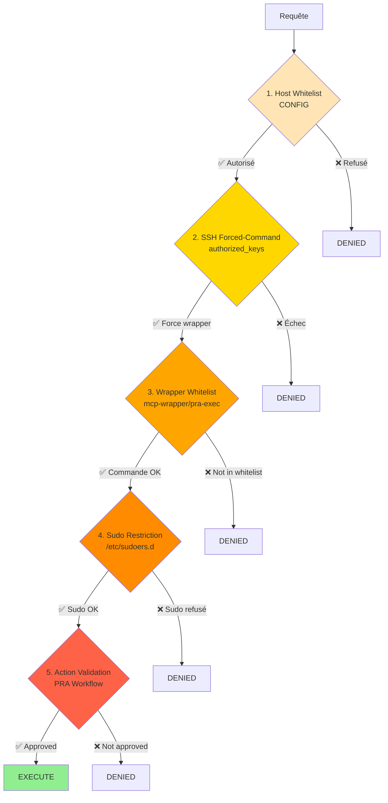
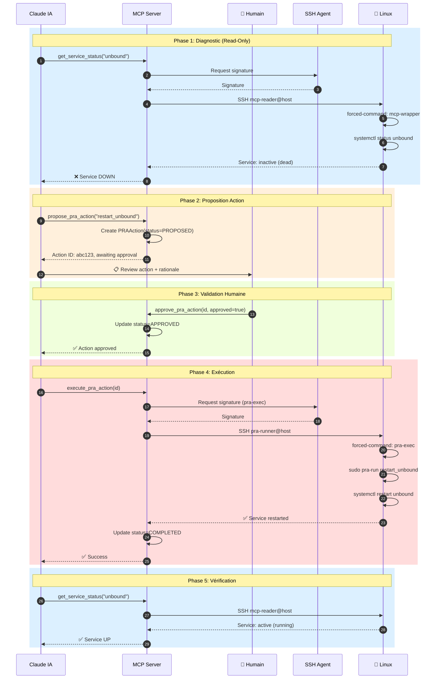
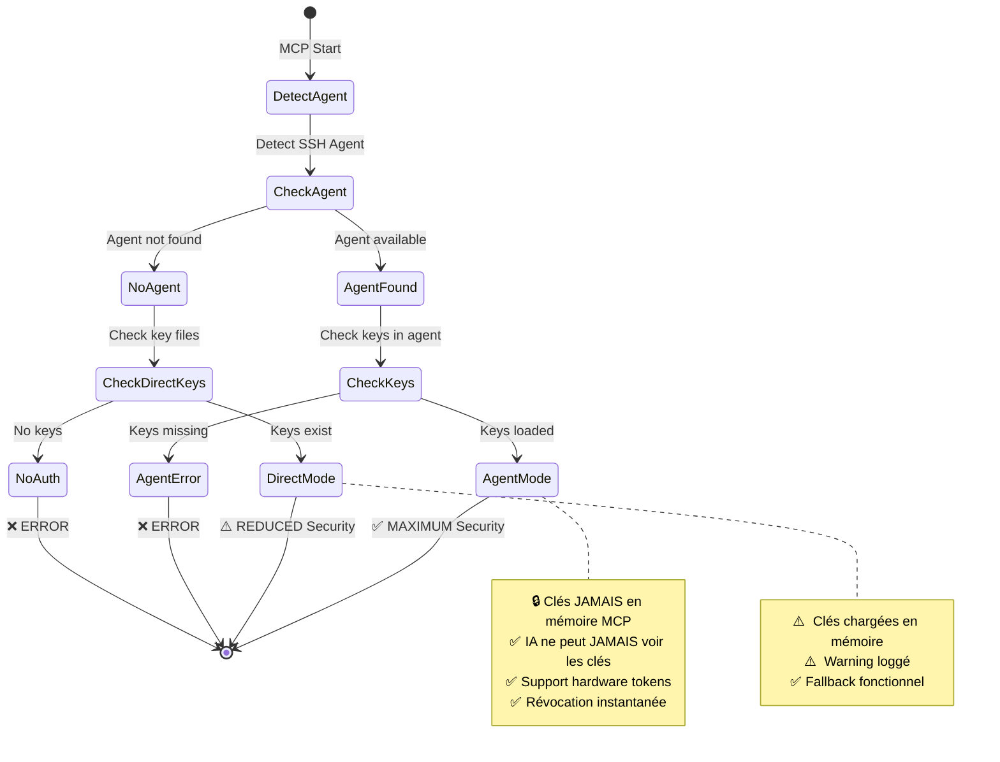
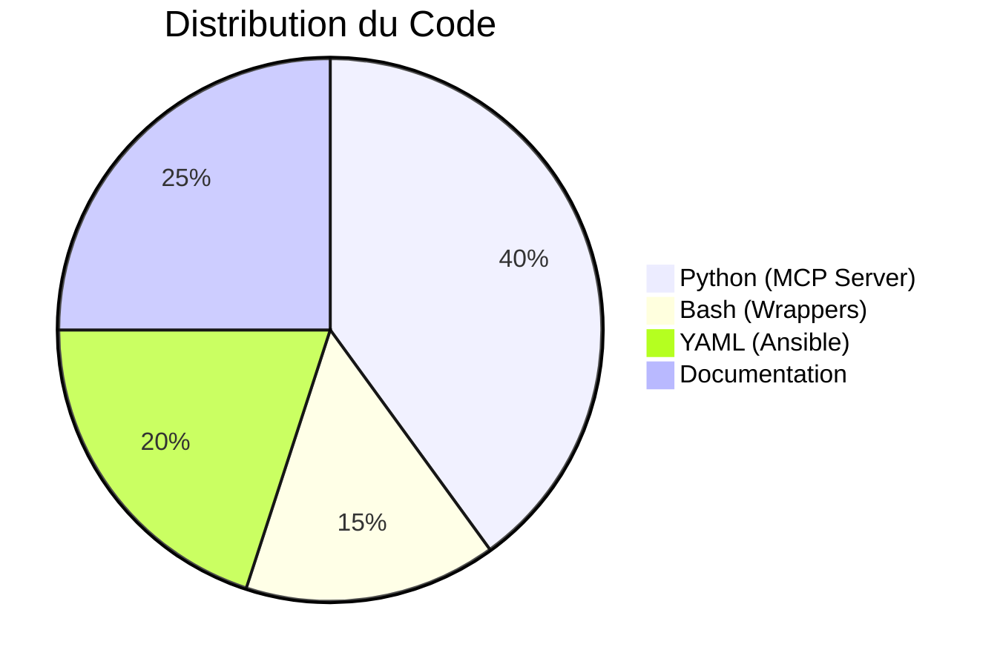

# MCP Linux Infra - Résumé du Projet

## 🎯 Objectif

**Gestion d'infrastructure Linux sécurisée via Model Context Protocol avec séparation stricte des privilèges SSH.**

## 🏗️ Architecture Complète

```mermaid
graph TB
    subgraph "🖥️ Windows (MCP Server)"
        Claude[Claude IA]
        MCP[MCP Linux Infra<br/>Python asyncssh]
        Agent[SSH Agent<br/>ou Clés Directes]
    end

    subgraph "🐧 Linux Targets"
        subgraph "👥 Comptes Système"
            Reader[mcp-reader<br/>read-only]
            Runner[pra-runner<br/>exec validé]
        end

        subgraph "🛡️ Sécurité (forced-command)"
            WrapperR[mcp-wrapper<br/>Whitelist diagnostics]
            WrapperE[pra-exec<br/>Whitelist actions]
            PRArun[pra-run<br/>Exécution sudo]
        end

        subgraph "⚙️ Système"
            Services[systemd<br/>unbound, caddy...]
            Logs[/var/log/*]
        end
    end

    Claude -->|propose_pra_action| MCP
    Claude -->|get_system_info| MCP
    MCP -->|SSH Agent| Agent
    Agent -.->|Signature| MCP

    MCP -->|SSH mcp-reader| Reader
    MCP -->|SSH pra-runner| Runner

    Reader --> WrapperR
    Runner --> WrapperE
    WrapperE --> PRArun

    WrapperR -.->|diagnostics| Services
    WrapperR -.->|read| Logs
    PRArun -->|actions| Services

    style Claude fill:#87CEEB
    style MCP fill:#90EE90
    style Agent fill:#FFD700
    style Reader fill:#DDA0DD
    style Runner fill:#FF6347
    style WrapperR fill:#98FB98
    style WrapperE fill:#FFA07A
```

## 🔐 Modèle de Sécurité

### Séparation des Privilèges

```mermaid
flowchart LR
    subgraph "Diagnostics (Read-Only)"
        K1[mcp-reader.key] --> U1[mcp-reader@host]
        U1 --> W1[/usr/local/bin/mcp-wrapper]
        W1 --> C1[systemctl status<br/>journalctl<br/>ss -lntup]
    end

    subgraph "Actions PRA (Exec Contrôlé)"
        K2[pra-exec.key] --> U2[pra-runner@host]
        U2 --> W2[/usr/local/bin/pra-exec]
        W2 --> S[sudo pra-run]
        S --> C2[restart service<br/>reload config]
    end

    style K1 fill:#87CEEB
    style K2 fill:#FF6347
    style C1 fill:#90EE90
    style C2 fill:#FFA07A
```

### 5 Couches de Défense



## 📊 Workflow PRA Complet



## 🔑 SSH Authentication Modes



## 📁 Structure du Projet

```
mcp-linux-infra/
├── 📄 README.md                    # Vue d'ensemble
├── 📄 INSTALL.md                   # Guide installation
├── 📄 PROJECT-SUMMARY.md          # Ce document
├── 📄 pyproject.toml              # Configuration Python
├── 📄 .env.example                # Configuration exemple
├── 🧪 test-installation.ps1       # Tests automatisés
│
├── 📂 src/mcp_linux_infra/
│   ├── 🐍 server.py               # MCP Server (FastMCP)
│   ├── ⚙️  config.py               # Configuration (Pydantic)
│   ├── 📊 audit.py                # Logging structuré
│   │
│   ├── 📂 connection/             # Gestion SSH
│   │   ├── smart_ssh.py          # Smart Manager (Agent + Fallback)
│   │   ├── ssh_agent.py          # SSH Agent pur
│   │   └── ssh.py                # Direct keys (legacy)
│   │
│   ├── 📂 tools/
│   │   ├── 📂 diagnostics/       # Read-Only Tools
│   │   │   ├── system.py         # CPU, RAM, disk
│   │   │   ├── services.py       # systemd
│   │   │   ├── network.py        # interfaces, ports
│   │   │   └── logs.py           # journalctl, logs
│   │   │
│   │   └── 📂 pra/               # PRA Tools
│   │       └── actions.py        # Workflow PRA complet
│   │
│   └── 📂 utils/
│
├── 📂 system/                     # Scripts Linux targets
│   ├── 📂 wrappers/
│   │   ├── mcp-wrapper           # Whitelist read-only
│   │   └── pra-exec              # Whitelist actions
│   ├── pra-run                   # Exécution sudo
│   └── 📂 sudoers.d/
│       └── pra-runner            # Config sudo
│
├── 📂 ansible/                    # Déploiement automatisé
│   ├── 📂 playbooks/
│   │   └── deploy-mcp-infra.yml
│   └── 📂 roles/mcp_infra/
│       ├── 📂 tasks/
│       ├── 📂 templates/
│       └── 📂 handlers/
│
├── 📂 docs/                       # Documentation complète
│   ├── ARCHITECTURE.md           # Architecture détaillée
│   ├── SECURITY.md               # Modèle sécurité
│   ├── SSH-AGENT-SECURITY.md     # SSH Agent guide
│   ├── PRA-PROCEDURES.md         # Procédures PRA
│   └── QUICKSTART.md             # Démarrage rapide
│
└── 📂 keys/                       # Clés SSH (gitignored)
    ├── mcp-reader.key
    ├── mcp-reader.key.pub
    ├── pra-exec.key
    └── pra-exec.key.pub
```

## 🛠️ Tools Disponibles

### Diagnostics (24 tools read-only)

| Catégorie | Tools | Description |
|-----------|-------|-------------|
| **Système** | `get_system_info`<br/>`get_cpu_info`<br/>`get_memory_info`<br/>`get_disk_usage`<br/>`get_block_devices` | Info système complète |
| **Services** | `list_services`<br/>`get_service_status`<br/>`get_service_logs`<br/>`check_service_health` | Gestion systemd |
| **Réseau** | `get_network_interfaces`<br/>`get_routing_table`<br/>`get_listening_ports`<br/>`get_active_connections`<br/>`get_dns_config`<br/>`test_connectivity` | Diagnostics réseau |
| **Logs** | `get_journal_logs`<br/>`read_log_file`<br/>`search_logs`<br/>`analyze_errors` | Analyse logs |

### Actions PRA (4 tools + workflow)

| Tool | Description |
|------|-------------|
| `propose_pra_action` | Proposer action avec rationale |
| `approve_pra_action` | Validation humaine |
| `execute_pra_action` | Exécution après approbation |
| `list_pending_actions` | Liste actions en attente |

### Actions PRA Disponibles

| Action | Impact | Description | Idempotent |
|--------|--------|-------------|------------|
| `restart_unbound` | LOW | Restart DNS Unbound | ✅ |
| `reload_caddy` | LOW | Reload Caddy config | ✅ |
| `flush_dns_cache` | LOW | Flush DNS cache | ✅ |
| `rotate_logs` | LOW | Force log rotation | ✅ |
| `restart_caddy` | MEDIUM | Restart Caddy | ✅ |
| `restart_container` | MEDIUM | Restart Podman container | ✅ |
| `reboot_system` | HIGH | System reboot | ⚠️ |

## 🚀 Démarrage Rapide

### Installation

```powershell
# 1. Cloner/copier projet
cd D:\infra\mcp-servers\mcp-linux-infra

# 2. Générer clés SSH
mkdir keys
ssh-keygen -t ed25519 -f keys/mcp-reader.key -N '""'
ssh-keygen -t ed25519 -f keys/pra-exec.key -N '""'

# 3. Charger dans SSH Agent
Start-Service ssh-agent
ssh-add keys/mcp-reader.key
ssh-add keys/pra-exec.key

# 4. Configuration
Copy-Item .env.example .env
# Éditer .env si nécessaire

# 5. Installer dépendances
uv sync

# 6. Test
.\test-installation.ps1
```

### Configuration Claude Desktop

```json
{
  "mcpServers": {
    "linux-infra": {
      "command": "uv",
      "args": [
        "--directory",
        "D:\\infra\\mcp-servers\\mcp-linux-infra",
        "run",
        "mcp-linux-infra"
      ],
      "env": {
        "LINUX_MCP_LOG_LEVEL": "INFO"
      }
    }
  }
}
```

## 📈 Statistiques Projet



- **~3500 lignes** de code Python
- **~500 lignes** de scripts Bash
- **~800 lignes** de playbooks Ansible
- **~5000 lignes** de documentation

## ✅ Checklist Production

### Avant Déploiement

- [ ] SSH Agent configuré et testé
- [ ] Clés SSH générées et sécurisées
- [ ] Targets Linux préparés (users, wrappers, sudo)
- [ ] Tests installation réussis
- [ ] Configuration .env validée
- [ ] Claude Desktop configuré

### Sécurité

- [ ] known_hosts strict activé (TODO)
- [ ] Host whitelist configuré
- [ ] Logs rotatés et monitorés
- [ ] Alerting configuré
- [ ] Procédures d'incident documentées
- [ ] Rotation clés planifiée

### Monitoring

- [ ] Audit logs analysés quotidiennement
- [ ] Métriques PRA suivies
- [ ] Targets health check automatique
- [ ] Dashboards créés

## 🎓 Concepts Clés

### Séparation des Privilèges

**2 comptes ≠ 2 clés ≠ 2 niveaux**

| Aspect | mcp-reader | pra-runner |
|--------|-----------|------------|
| **Clé SSH** | mcp-reader.key | pra-exec.key |
| **Shell** | /bin/bash | /usr/sbin/nologin |
| **Sudo** | ❌ AUCUN | ✅ 1 script seulement |
| **Usage** | Diagnostics | Actions validées |
| **Risque** | Faible | Moyen |

### Zero Trust

- ✅ Toute commande = whitelist
- ✅ Toute action PRA = validation humaine
- ✅ Tout accès = loggé
- ✅ Aucun wildcard
- ✅ Principe moindre privilège

### Defense in Depth

5 couches indépendantes :
1. CONFIG whitelist
2. SSH forced-command
3. Wrapper whitelist
4. Sudo restriction
5. PRA validation

**Compromission d'une couche ≠ compromission système**

## 🔮 Roadmap

- [ ] Bastion/Jumphost support
- [ ] Strict known_hosts validation
- [ ] Actions PRA paramétrées
- [ ] Integration Vault (secrets)
- [ ] Métriques Prometheus
- [ ] Dashboard validation PRA
- [ ] Multi-tenancy support
- [ ] Hardware token (YubiKey) guide complet

## 📚 Références

### Documentation Interne

- [Architecture](docs/ARCHITECTURE.md)
- [Sécurité](docs/SECURITY.md)
- [SSH Agent](docs/SSH-AGENT-SECURITY.md)
- [Procédures PRA](docs/PRA-PROCEDURES.md)
- [Démarrage Rapide](docs/QUICKSTART.md)
- [Installation](INSTALL.md)

### Technologies Utilisées

- **MCP SDK:** Model Context Protocol
- **asyncssh:** SSH client async Python
- **Pydantic:** Configuration et validation
- **Ansible:** Déploiement automatisé
- **FastMCP:** Framework MCP

### Ressources Externes

- [MCP Documentation](https://modelcontextprotocol.io/)
- [asyncssh](https://asyncssh.readthedocs.io/)
- [OpenSSH](https://www.openssh.com/)
- [Ansible](https://docs.ansible.com/)

## 🤝 Contribution

1. Lire `docs/ARCHITECTURE.md`
2. Comprendre le modèle de sécurité
3. Tester avec `test-installation.ps1`
4. Ajouter tests pour nouvelles features
5. Documenter avec diagrammes Mermaid

## 📄 License

MIT License - Voir LICENSE

---

**MCP Linux Infra** - Infrastructure Management avec Sécurité Maximale

*Créé avec ❤️ pour une gestion d'infrastructure production-ready*
