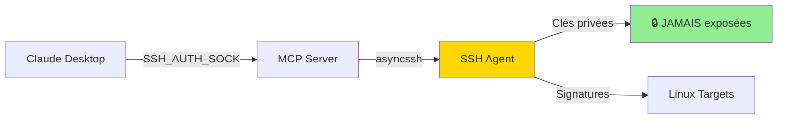

# Setup Final - MCP Linux Infra avec SSH Agent

## ✅ Configuration Actuelle

**Mode d'authentification :** SSH Agent UNIQUEMENT (sécurité maximale)



## 📋 Checklist

### ✅ Prérequis Complétés

- [x] Service ssh-agent Windows en cours d'exécution
- [x] Au moins une clé SSH chargée dans l'agent
- [x] Python 3.11+ et uv installés
- [x] Dépendances MCP installées (`uv sync`)

### 🎯 Configuration Claude Desktop

**Fichier :** `%APPDATA%\Claude\claude_desktop_config.json`

**Contenu :** (copier depuis `claude-desktop-config-final.json`)

```json
{
  "mcpServers": {
    "linux-infra": {
      "command": "uv",
      "args": [
        "--directory",
        "D:\\infra\\mcp-servers\\mcp-linux-infra",
        "run",
        "mcp-linux-infra"
      ],
      "env": {
        "SSH_AUTH_SOCK": "\\\\.\\pipe\\openssh-ssh-agent",
        "LINUX_MCP_LOG_LEVEL": "INFO"
      }
    }
  }
}
```

**Points clés :**
- ✅ `SSH_AUTH_SOCK` défini pour accès agent Windows
- ✅ Aucun chemin de clé privée (sécurité maximale)
- ✅ MCP Server n'a JAMAIS accès aux clés

## 🔐 Vérification Sécurité

**Ce que le MCP Server NE PEUT PAS faire :**
- ❌ Lire les clés privées (elles sont dans l'agent)
- ❌ Exporter les clés (l'agent signe seulement)
- ❌ Accéder aux fichiers de clés (aucun chemin configuré)

**Ce qu'il PEUT faire :**
- ✅ Demander à l'agent de signer (via SSH_AUTH_SOCK)
- ✅ Utiliser les signatures pour SSH
- ✅ Se connecter aux targets avec les clés de l'agent

## 🚀 Démarrage

### 1. Copier la Configuration

```powershell
# Ouvrir la config Claude Desktop
notepad $env:APPDATA\Claude\claude_desktop_config.json

# Copier le contenu de claude-desktop-config-final.json
# Sauvegarder
```

### 2. Redémarrer Claude Desktop

Fermer complètement et relancer Claude Desktop.

### 3. Vérifier la Connexion

Dans Claude, demander :

```
Check if the linux-infra MCP server is connected
```

Tu devrais voir :
```
✅ linux-infra server connected
📋 24 diagnostic tools available
⚡ 4 PRA workflow tools available
```

### 4. Test d'Authentification

Dans Claude :

```
What authentication mode is the linux-infra server using?
```

Résultat attendu :
```
🔒 Using SSH Agent (MAXIMUM security)
✅ Private keys never loaded in MCP process
```

## 🎯 Utilisation

### Diagnostics (sans target Linux pour l'instant)

```
Show me the available diagnostic tools
```

### Test Connexion (quand target configuré)

```
Get system info for web01.infra
```

### Workflow PRA (quand target configuré)

```
Check the status of unbound service on web01.infra

If it's down, propose a restart action with rationale
```

## 📊 Monitoring

### Logs MCP Server

```powershell
# Logs structurés JSON (si LOG_DIR configuré)
Get-Content D:\infra\mcp-servers\mcp-linux-infra\logs\mcp-audit-*.json | ConvertFrom-Json | Format-Table

# Filtrer par type
Get-Content logs\mcp-audit-*.json | ConvertFrom-Json | Where-Object { $_.event_type -like "*ssh*" }
```

### Vérifier Mode Auth

Le premier tool call loggera :

**Si Agent fonctionne :**
```json
{
  "auth_mode": "SSH_AGENT",
  "security_level": "MAXIMUM",
  "message": "✅ Using SSH Agent (private keys never in memory)"
}
```

**Si fallback :**
```json
{
  "auth_mode": "DIRECT_KEYS",
  "security_level": "REDUCED",
  "warning": "⚠️  SSH Agent not available, using direct keys (less secure)"
}
```

## 🐛 Troubleshooting

### Problème : "SSH Agent not available"

**Solution :**
```powershell
# Vérifier service
Get-Service ssh-agent

# Si arrêté
Start-Service ssh-agent

# Vérifier clés chargées
ssh-add -l
```

### Problème : "Could not open connection to agent"

**Solution :**

La variable `SSH_AUTH_SOCK` n'est pas passée correctement.

Vérifier dans `claude_desktop_config.json` :
```json
"env": {
  "SSH_AUTH_SOCK": "\\\\.\\pipe\\openssh-ssh-agent"
}
```

### Problème : "No identities"

**Solution :**

Aucune clé dans l'agent. Charger une clé :
```powershell
ssh-add C:\Users\ton-user\.ssh\id_ed25519
# Ou ta clé habituelle
```

## 📝 Notes Importantes

**Clés pour les Targets Linux :**

Les clés dans ton agent Windows doivent correspondre aux `authorized_keys` sur les targets :

```bash
# Sur chaque target Linux
# /home/mcp-reader/.ssh/authorized_keys
command="/usr/local/bin/mcp-wrapper",no-pty,no-agent-forwarding ssh-ed25519 AAAA... (ta clé publique)

# /home/pra-runner/.ssh/authorized_keys
command="/usr/local/bin/pra-exec",no-pty,no-agent-forwarding ssh-ed25519 AAAA... (ta clé publique)
```

**Important :** Utilise la même clé pour les 2 comptes, ou charge 2 clés différentes dans l'agent.

## 🎓 Prochaines Étapes

1. **Déployer sur targets Linux** : Utiliser Ansible (`ansible/playbooks/deploy-mcp-infra.yml`)
2. **Tester diagnostics** : `get_system_info(host="target")`
3. **Tester workflow PRA** : propose → approve → execute
4. **Monitoring** : Analyser logs audit
5. **Ajouter actions PRA** : Étendre le catalogue selon besoins

## 📚 Documentation

- [Architecture complète](docs/ARCHITECTURE.md)
- [Sécurité SSH Agent](docs/SSH-AGENT-SECURITY.md)
- [Procédures PRA](docs/PRA-PROCEDURES.md)
- [Vue d'ensemble](PROJECT-SUMMARY.md)

---

**🎉 Configuration Terminée !**

Le MCP Server est configuré en mode sécurité maximale avec SSH Agent.
Aucune clé privée n'est jamais accessible au code MCP.
