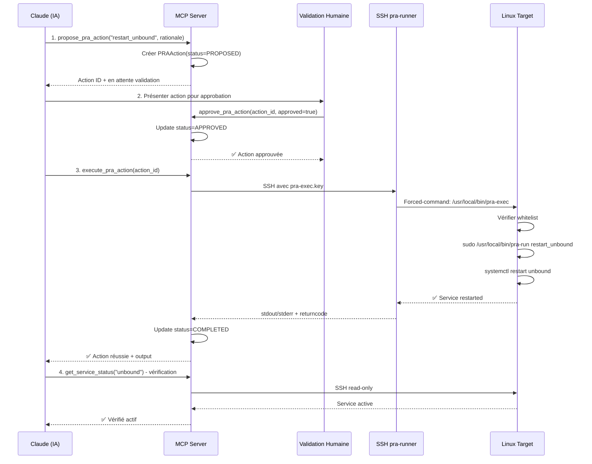
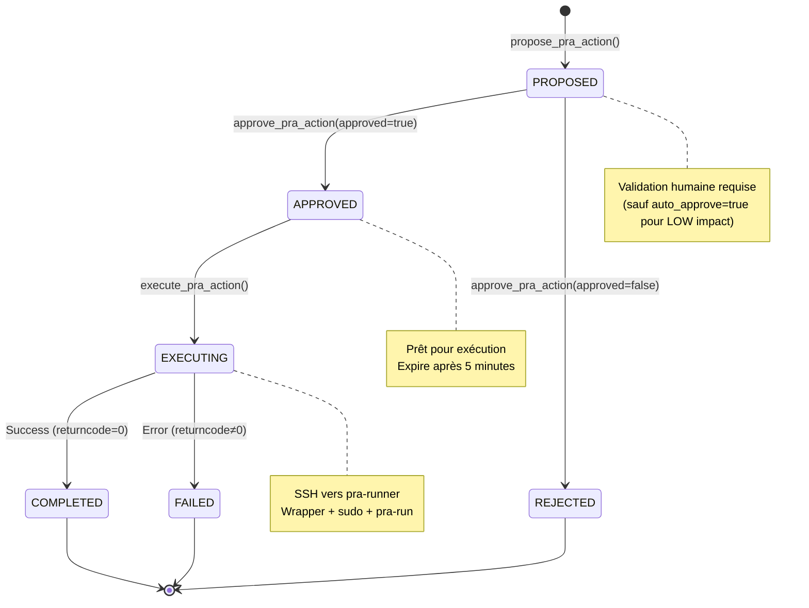
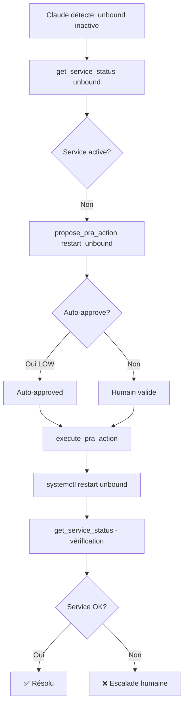
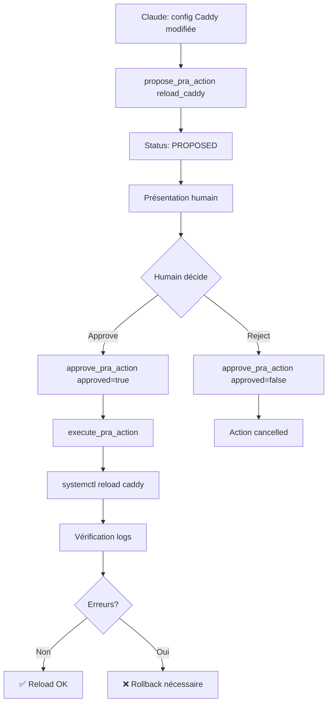
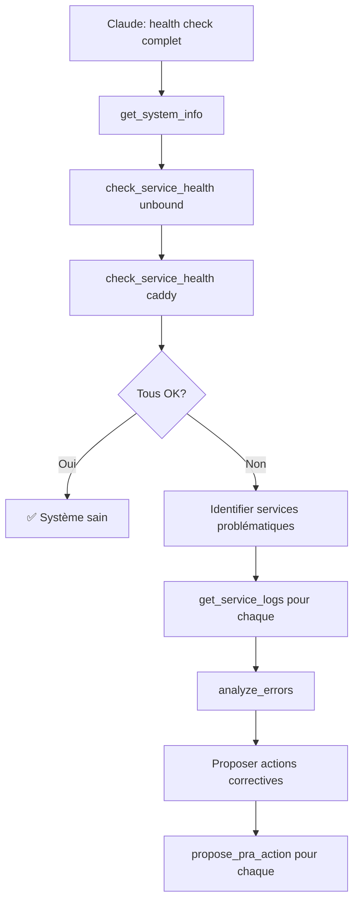
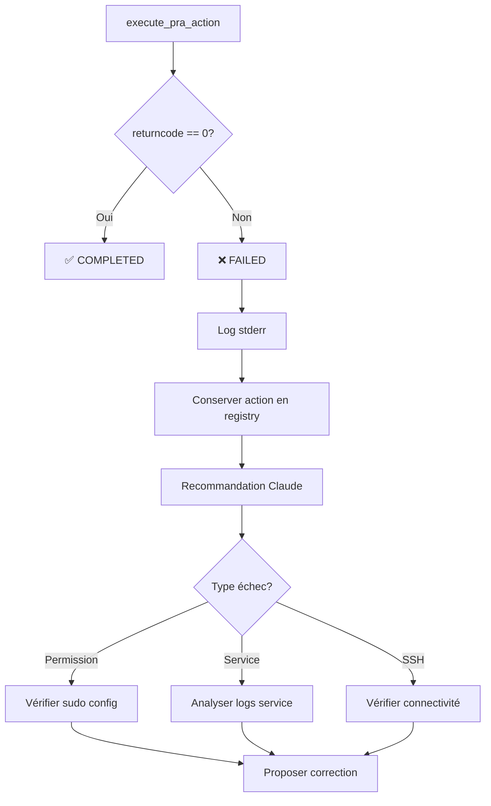
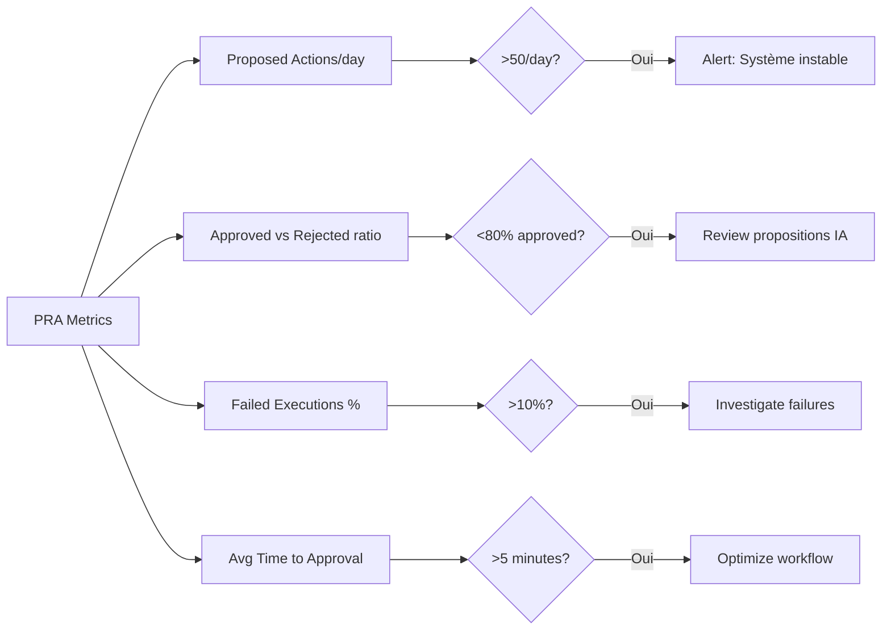

# Procédures PRA (Plan de Reprise d'Activité)

## Workflow PRA Complet



## État des Actions PRA



## Actions PRA Disponibles

### LOW Impact (auto-approve possible)

| Action | Description | Commande | Idempotent |
|--------|-------------|----------|------------|
| `restart_unbound` | Redémarrage DNS Unbound | `systemctl restart unbound` | ✅ |
| `reload_caddy` | Rechargement config Caddy | `systemctl reload caddy` | ✅ |
| `flush_dns_cache` | Purge cache DNS | `resolvectl flush-caches` | ✅ |
| `rotate_logs` | Rotation logs forcée | `logrotate -f /etc/logrotate.conf` | ✅ |

### MEDIUM Impact (validation humaine obligatoire)

| Action | Description | Commande | Idempotent |
|--------|-------------|----------|------------|
| `restart_caddy` | Redémarrage complet Caddy | `systemctl restart caddy` | ✅ |
| `restart_container` | Redémarrage conteneur Podman | `podman restart <name>` | ✅ |

### HIGH Impact (validation + confirmation)

| Action | Description | Commande | Idempotent |
|--------|-------------|----------|------------|
| `reboot_system` | Redémarrage système | `systemctl reboot` | ⚠️ |

## Scénarios d'Usage

### Scénario 1: Service Unbound Inactif



**Commandes:**
```python
# 1. Diagnostic
status = get_service_status("unbound", host="dns01.infra")
# Résultat: inactive (dead)

# 2. Proposition
result = propose_pra_action(
    action="restart_unbound",
    host="dns01.infra",
    rationale="Service unbound inactive, impact résolution DNS pour l'infrastructure",
    auto_approve=True  # LOW impact
)
# Résultat: Action auto-approved, ID: abc123

# 3. Exécution
exec_result = execute_pra_action(action_id="abc123")
# Résultat: ✅ Service restarted successfully

# 4. Vérification
verify = get_service_status("unbound", host="dns01.infra")
# Résultat: active (running)
```

### Scénario 2: Caddy Config Reload (Validation Humaine)



**Commandes:**
```python
# 1. Proposition
result = propose_pra_action(
    action="reload_caddy",
    host="proxy01.infra",
    rationale="Configuration Caddy mise à jour, reload nécessaire pour appliquer",
    auto_approve=False  # MEDIUM impact
)
# Résultat: Action ID: def456, awaiting approval

# 2. [HUMAIN VALIDE via interface]

# 3. Approbation
approval = approve_pra_action(
    action_id="def456",
    approved=True,
    approver="ops-john"
)
# Résultat: ✅ Approved by ops-john

# 4. Exécution
exec_result = execute_pra_action(action_id="def456")
# Résultat: ✅ Caddy reloaded

# 5. Vérification
logs = get_service_logs("caddy", lines=50, host="proxy01.infra")
errors = analyze_errors(service="caddy", since="1m", host="proxy01.infra")
# Vérifier aucune erreur
```

### Scénario 3: Diagnostics Multi-Services



**Commandes:**
```python
# Health check complet
services = ["unbound", "caddy", "podman"]

for svc in services:
    health = check_service_health(svc, host="infra01")
    if "UNHEALTHY" in health:
        # Analyser erreurs
        errors = analyze_errors(service=svc, since="1h", host="infra01")

        # Proposer action
        if "unbound" in svc:
            propose_pra_action(
                action="restart_unbound",
                host="infra01",
                rationale=f"Service unhealthy: {errors[:200]}"
            )
```

## Gestion des Échecs

### Échec d'Exécution



**Exemple échec:**
```python
result = execute_pra_action(action_id="xyz789")
# Résultat:
# ❌ PRA Action Failed
# Exit Code: 1
# Error: Job for unbound.service failed because the control process exited with error code.

# Claude analyse:
logs = get_service_logs("unbound", lines=100, host="dns01.infra")
# Identifier cause racine (ex: config error)

# Proposer fix
propose_pra_action(
    action="check_config_then_restart",  # Nouvelle action
    rationale="Config error detected, need validation before restart"
)
```

### Timeout SSH

```python
try:
    result = execute_pra_action(action_id="abc123")
except SSHConnectionError as e:
    # Retry avec backoff
    # Ou escalade humaine
    logger.error(f"SSH timeout: {e}")
```

## Bonnes Pratiques

### ✅ DO

1. **Toujours diagnostiquer avant d'agir**
```python
# BIEN
status = get_service_status("unbound")
if "inactive" in status:
    propose_pra_action("restart_unbound", ...)

# MAUVAIS
propose_pra_action("restart_unbound", rationale="just in case")
```

2. **Vérifier après action**
```python
execute_pra_action(action_id)
time.sleep(2)  # Laisser service démarrer
verify = get_service_status("unbound")
```

3. **Rationale explicite**
```python
# BIEN
rationale = "Service unbound inactive depuis 10min, impact DNS sur 15 hosts, logs montrent OOM"

# MAUVAIS
rationale = "service down"
```

4. **Actions atomiques**
```python
# BIEN: 1 action = 1 service
propose_pra_action("restart_unbound", ...)
propose_pra_action("reload_caddy", ...)

# MAUVAIS: actions groupées
propose_pra_action("restart_all_services", ...)  # Trop large
```

### ❌ DON'T

1. **Auto-approve MEDIUM/HIGH impact**
```python
# MAUVAIS
propose_pra_action("reboot_system", auto_approve=True)  # DANGEREUX
```

2. **Actions en cascade sans vérification**
```python
# MAUVAIS
for svc in all_services:
    execute_pra_action(...)  # Pas de vérification entre
```

3. **Ignorer les échecs**
```python
# MAUVAIS
result = execute_pra_action(...)
# Pas de vérification du résultat
```

4. **Actions sans contexte**
```python
# MAUVAIS: pas de diagnostic avant
propose_pra_action("restart_unbound", rationale="AI intuition")
```

## Ajout d'une Nouvelle Action PRA

### 1. Définir l'Action

```python
# src/mcp_linux_infra/tools/pra/actions.py

PRA_ACTION_CATALOG = {
    "restart_postgresql": {
        "description": "Restart PostgreSQL database",
        "impact": PRAImpact.HIGH,  # DB = high impact
        "command": "restart_postgresql",
    },
}
```

### 2. Wrapper Whitelist

```bash
# system/wrappers/pra-exec

case "$SSH_ORIGINAL_COMMAND" in
    "restart_postgresql")
        echo "Executing: systemctl restart postgresql"
        exec sudo /usr/local/bin/pra-run restart_postgresql
        ;;
```

### 3. Implémentation

```bash
# system/pra-run

case "$ACTION" in
    restart_postgresql)
        echo "Restarting PostgreSQL..."
        systemctl restart postgresql
        systemctl --no-pager status postgresql
        echo "$(date -Iseconds) SUCCESS: restart_postgresql" >> "$LOGFILE"
        ;;
```

### 4. Test Idempotence

```bash
# Sur target
sudo /usr/local/bin/pra-run restart_postgresql
# Vérifier succès

sudo /usr/local/bin/pra-run restart_postgresql
# Re-run: doit aussi réussir (idempotent)
```

### 5. Déploiement

```bash
# Copier scripts sur targets
ansible-playbook -i inventory/production.ini playbooks/deploy-mcp-infra.yml --tags wrappers

# Tester via MCP
propose_pra_action("restart_postgresql", host="db01.infra", rationale="test", auto_approve=False)
```

## Monitoring et Alerting

### Métriques à Suivre



### Logs à Monitorer

```bash
# Actions PRA par jour
grep "PRA_PROPOSED" mcp-audit-*.json | jq -r '.timestamp' | cut -d'T' -f1 | uniq -c

# Taux d'échec
grep "PRA_FAILED" mcp-audit-*.json | wc -l

# Actions par type
grep "PRA_EXECUTED" mcp-audit-*.json | jq -r '.details.action' | sort | uniq -c
```

## Troubleshooting

### Problème: Action Bloquée en PROPOSED

**Symptômes:**
- Action reste en PROPOSED
- Pas d'approbation humaine

**Solutions:**
1. Vérifier liste pending: `list_pending_actions()`
2. Approuver manuellement: `approve_pra_action(action_id, approved=True)`
3. Ou rejeter: `approve_pra_action(action_id, approved=False)`

### Problème: SSH Connection Failed

**Symptômes:**
- `SSHConnectionError`
- Timeout

**Solutions:**
1. Vérifier connectivité: `test_connectivity(target="host")`
2. Vérifier clé SSH: `ssh -i pra-exec.key pra-runner@host`
3. Vérifier logs SSH target: `/var/log/auth.log`
4. Vérifier firewall

### Problème: Action DENIED par Wrapper

**Symptômes:**
- `DENIED: Action not whitelisted`

**Solutions:**
1. Vérifier action existe dans PRA_ACTION_CATALOG
2. Vérifier whitelist dans `/usr/local/bin/pra-exec`
3. Redéployer wrappers: `ansible-playbook ... --tags wrappers`

### Problème: Sudo Failed

**Symptômes:**
- `sudo: command not found`
- Permission denied

**Solutions:**
1. Vérifier sudoers: `sudo visudo -c`
2. Vérifier `/etc/sudoers.d/pra-runner`
3. Tester sudo: `sudo -u pra-runner sudo /usr/local/bin/pra-run restart_unbound`

## Exemples Complets

### Workflow DNS Recovery

```python
# 1. Détection problème
dns_status = get_service_status("unbound", host="dns01.infra")
print(dns_status)
# Output: Service inactive

# 2. Analyse logs
errors = analyze_errors(service="unbound", since="1h", host="dns01.infra")
print(errors)
# Output: OOM killer terminated unbound

# 3. Vérifier mémoire
memory = get_memory_info(host="dns01.infra")
print(memory)
# Output: Swap full, RAM 95%

# 4. Proposer actions
# Action 1: Restart service
action1 = propose_pra_action(
    action="restart_unbound",
    host="dns01.infra",
    rationale="Service killed by OOM, restart required",
    auto_approve=True
)

# Action 2: Cleanup (future)
# propose_pra_action("free_memory", ...)

# 5. Exécuter
result = execute_pra_action(action_id=action1["id"])

# 6. Vérifier
verify = check_service_health("unbound", host="dns01.infra")
print(verify)
# Output: 🟢 HEALTHY

# 7. Monitoring continu
# Configurer alert si mémoire >90%
```

## Checklist Déploiement Production

- [ ] Wrappers déployés et testés sur tous targets
- [ ] Sudoers configuré et validé
- [ ] Clés SSH générées et distribuées
- [ ] Logs rotation configurée
- [ ] Monitoring et alerting actifs
- [ ] Procédures d'escalation documentées
- [ ] Tests d'idempotence effectués
- [ ] Runbook incident response prêt
- [ ] Contacts on-call définis
- [ ] Backup/rollback procedures testées
