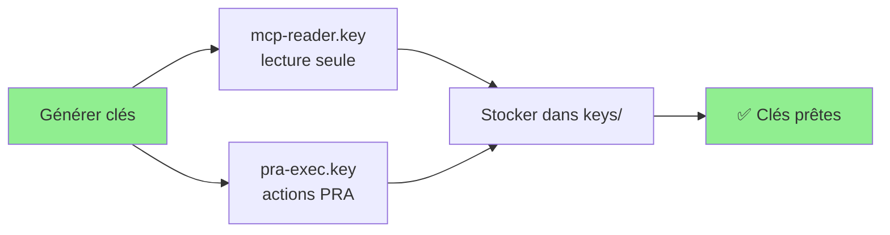
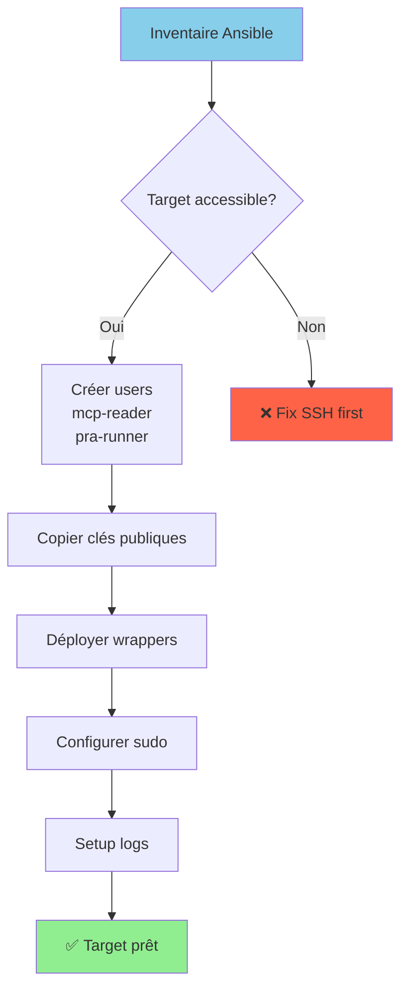
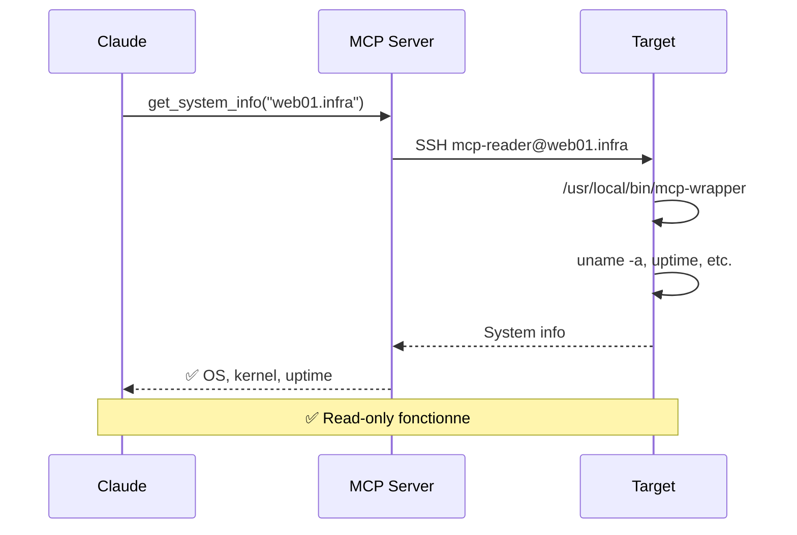
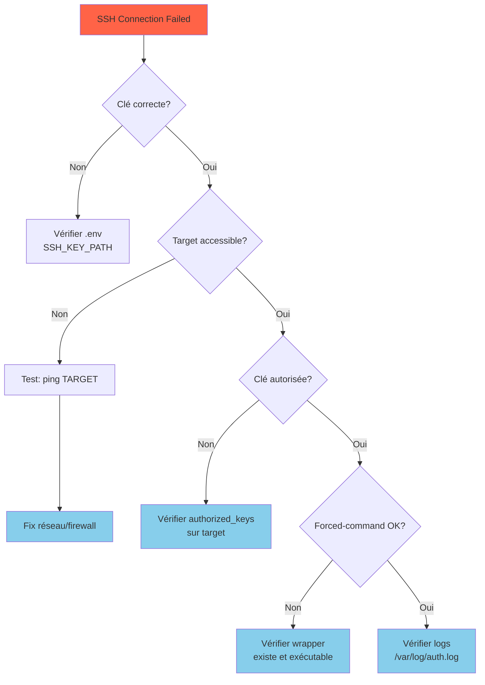

# Guide de Démarrage Rapide

## Architecture Globale

```mermaid
graph TB
    subgraph "Windows (MCP Server)"
        MCP[MCP Linux Infra<br/>Python + asyncssh]
        Keys[SSH Keys<br/>mcp-reader.key<br/>pra-exec.key]
    end

    subgraph "Linux Targets"
        subgraph "User Layer"
            Reader[mcp-reader<br/>read-only]
            Runner[pra-runner<br/>exec]
        end

        subgraph "Security Layer"
            WrapperR[/usr/local/bin/mcp-wrapper<br/>Whitelist read-only]
            WrapperE[/usr/local/bin/pra-exec<br/>Whitelist actions]
            PRArun[/usr/local/bin/pra-run<br/>sudo]
        end

        subgraph "System Layer"
            Services[systemd services<br/>unbound, caddy...]
            Logs[/var/log/*]
        end
    end

    MCP -->|SSH mcp-reader.key| Reader
    MCP -->|SSH pra-exec.key| Runner

    Reader --> WrapperR
    Runner --> WrapperE

    WrapperR -.->|diagnostics| Services
    WrapperR -.->|read| Logs

    WrapperE --> PRArun
    PRArun -->|modify| Services

    style MCP fill:#90EE90
    style Reader fill:#87CEEB
    style Runner fill:#FFB6C1
    style WrapperR fill:#DDA0DD
    style WrapperE fill:#F08080
    style PRArun fill:#FF6347
```

## Installation en 5 Étapes

### Étape 1: Générer les Clés SSH



```bash
cd D:\infra\mcp-servers\mcp-linux-infra

# Créer répertoire keys
mkdir keys
cd keys

# Clé diagnostics (read-only)
ssh-keygen -t ed25519 -f mcp-reader.key -C "mcp-reader@infra-$(date +%Y%m%d)" -N ""

# Clé PRA (exec)
ssh-keygen -t ed25519 -f pra-exec.key -C "pra-runner@infra-$(date +%Y%m%d)" -N ""

# Vérifier
ls -la
# mcp-reader.key
# mcp-reader.key.pub
# pra-exec.key
# pra-exec.key.pub
```

### Étape 2: Déployer sur Targets Linux



**Option A: Ansible (recommandé)**

```bash
cd ansible

# Créer inventaire
cat > inventory/production.ini << 'EOF'
[all]
web01.infra ansible_host=192.168.1.10
web02.infra ansible_host=192.168.1.11
db01.infra ansible_host=192.168.1.20
EOF

# Créer variables
cat > group_vars/all.yml << 'EOF'
---
mcp_reader_pubkey: "{{ lookup('file', '../keys/mcp-reader.key.pub') }}"
pra_exec_pubkey: "{{ lookup('file', '../keys/pra-exec.key.pub') }}"
EOF

# Déployer
ansible-playbook -i inventory/production.ini playbooks/deploy-mcp-infra.yml

# Vérifier
ansible -i inventory/production.ini all -m ping
```

**Option B: Manuel (1 target)**

```bash
# Sur votre machine Windows
$TARGET="web01.infra"
$READER_PUB=$(Get-Content keys\mcp-reader.key.pub)
$EXEC_PUB=$(Get-Content keys\pra-exec.key.pub)

# SSH vers target (avec compte admin)
ssh admin@$TARGET

# Sur target Linux
sudo su -

# Créer utilisateurs
useradd -m -s /bin/bash -c "MCP Read-Only" mcp-reader
useradd -m -s /usr/sbin/nologin -c "PRA Exec" pra-runner

# Configurer SSH
mkdir -p /home/mcp-reader/.ssh
echo 'command="/usr/local/bin/mcp-wrapper",no-pty,no-agent-forwarding,no-X11-forwarding ssh-ed25519 AAAAC3Nza...' > /home/mcp-reader/.ssh/authorized_keys
chmod 700 /home/mcp-reader/.ssh
chmod 600 /home/mcp-reader/.ssh/authorized_keys
chown -R mcp-reader:mcp-reader /home/mcp-reader/.ssh

# Même chose pour pra-runner...

# Copier wrappers depuis repo
# ... (voir system/wrappers/)

# Tester
ssh -i /path/to/mcp-reader.key mcp-reader@$TARGET "systemctl status sshd"
```

### Étape 3: Configurer MCP Server

```bash
cd D:\infra\mcp-servers\mcp-linux-infra

# Copier configuration
cp .env.example .env

# Éditer .env
notepad .env
```

**Configuration minimale:**
```bash
# .env
LINUX_MCP_SSH_KEY_PATH=D:/infra/mcp-servers/mcp-linux-infra/keys/mcp-reader.key
LINUX_MCP_PRA_KEY_PATH=D:/infra/mcp-servers/mcp-linux-infra/keys/pra-exec.key
LINUX_MCP_PRA_USER=pra-runner
LINUX_MCP_LOG_LEVEL=INFO
LINUX_MCP_ALLOWED_HOSTS=web01.infra,web02.infra,db01.infra
```

### Étape 4: Installer Dépendances

```bash
# Installer uv (si pas déjà fait)
powershell -c "irm https://astral.sh/uv/install.ps1 | iex"

# Installer dépendances
cd D:\infra\mcp-servers\mcp-linux-infra
uv sync

# Tester
uv run mcp-linux-infra --help
```

### Étape 5: Enregistrer dans Claude Desktop

```json
{
  "mcpServers": {
    "linux-infra": {
      "command": "uv",
      "args": [
        "--directory",
        "D:\\infra\\mcp-servers\\mcp-linux-infra",
        "run",
        "mcp-linux-infra"
      ],
      "env": {
        "LINUX_MCP_SSH_KEY_PATH": "D:\\infra\\mcp-servers\\mcp-linux-infra\\keys\\mcp-reader.key",
        "LINUX_MCP_PRA_KEY_PATH": "D:\\infra\\mcp-servers\\mcp-linux-infra\\keys\\pra-exec.key",
        "LINUX_MCP_LOG_LEVEL": "INFO"
      }
    }
  }
}
```

**Emplacement:** `%APPDATA%\Claude\claude_desktop_config.json`

**Redémarrer Claude Desktop**

## Vérification Installation

### Test 1: Diagnostic Read-Only



**Dans Claude:**
```
User: Check system info for web01.infra

Claude utilise: get_system_info(host="web01.infra")

Résultat attendu:
## OS
NAME="Ubuntu"
VERSION="22.04.3 LTS"

## Kernel
Linux web01 5.15.0-91-generic

## Uptime
up 45 days, 3:24
```

### Test 2: Service Status

```
User: What's the status of unbound service on web01.infra?

Claude utilise: get_service_status("unbound", host="web01.infra")

Résultat attendu:
● unbound.service - Unbound DNS server
   Loaded: loaded
   Active: active (running) since...
```

### Test 3: PRA Workflow


**Dans Claude:**
```
User: Propose restarting unbound on web01.infra

Claude:
1. propose_pra_action(
     action="restart_unbound",
     host="web01.infra",
     rationale="Test PRA workflow",
     auto_approve=True
   )

2. execute_pra_action(action_id="abc123")

3. get_service_status("unbound", host="web01.infra")

Résultat attendu:
✅ Service restarted successfully
✅ Service is active (running)
```

## Commandes Utiles

### Diagnostics Courants

```bash
# Info système
get_system_info(host="web01.infra")
get_cpu_info(host="web01.infra")
get_memory_info(host="web01.infra")
get_disk_usage(host="web01.infra")

# Services
list_services(host="web01.infra")
get_service_status("nginx", host="web01.infra")
check_service_health("nginx", host="web01.infra")

# Réseau
get_network_interfaces(host="web01.infra")
get_listening_ports(host="web01.infra")
test_connectivity("8.8.8.8", host="web01.infra")
get_dns_config(host="web01.infra")

# Logs
get_journal_logs(lines=100, priority="err", host="web01.infra")
get_service_logs("nginx", lines=50, host="web01.infra")
analyze_errors(service="nginx", since="1h", host="web01.infra")
```

### Actions PRA

```bash
# Lister actions en attente
list_pending_actions()

# Proposer action
propose_pra_action(
    action="restart_unbound",
    host="web01.infra",
    rationale="Service down"
)

# Approuver
approve_pra_action(
    action_id="abc123",
    approved=True,
    approver="john"
)

# Exécuter
execute_pra_action(action_id="abc123")
```

## Troubleshooting

### Problème: "SSH Connection Failed"



**Solutions:**

```bash
# Test 1: Connectivité
ping web01.infra

# Test 2: SSH manuel
ssh -i keys/mcp-reader.key mcp-reader@web01.infra

# Test 3: Vérifier wrapper sur target
ssh admin@web01.infra "ls -la /usr/local/bin/mcp-wrapper"

# Test 4: Logs SSH sur target
ssh admin@web01.infra "sudo tail -50 /var/log/auth.log"
```

### Problème: "Action DENIED"

**Cause:** Action non dans whitelist

**Solution:**
```bash
# 1. Vérifier action existe
grep "restart_unbound" src/mcp_linux_infra/tools/pra/actions.py

# 2. Vérifier whitelist sur target
ssh admin@web01.infra "cat /usr/local/bin/pra-exec | grep restart_unbound"

# 3. Redéployer si manquant
cd ansible
ansible-playbook -i inventory/production.ini playbooks/deploy-mcp-infra.yml --tags wrappers
```

### Problème: "Permission Denied" (sudo)

**Solution:**
```bash
# Sur target
sudo visudo -c  # Vérifier syntaxe
cat /etc/sudoers.d/pra-runner  # Vérifier config

# Test sudo
sudo -u pra-runner sudo /usr/local/bin/pra-run restart_unbound
```

## Monitoring

### Logs MCP Server (Windows)

```powershell
# Logs structurés JSON
Get-Content D:\infra\mcp-servers\mcp-linux-infra\logs\mcp-audit-*.json | ConvertFrom-Json | Format-Table

# Filtrer erreurs
Get-Content logs\mcp-audit-*.json | ConvertFrom-Json | Where-Object { $_.status -eq "failure" }

# PRA actions
Get-Content logs\mcp-audit-*.json | ConvertFrom-Json | Where-Object { $_.event_type -like "pra_*" }
```

### Logs Target Linux

```bash
# SSH connections
sudo tail -f /var/log/auth.log | grep "mcp-reader\|pra-runner"

# Read-only commands
sudo tail -f /var/log/mcp-wrapper.log

# PRA actions
sudo tail -f /var/log/pra-exec.log /var/log/pra-run.log

# Tout en une vue
sudo multitail /var/log/auth.log /var/log/mcp-wrapper.log /var/log/pra-exec.log
```

## Prochaines Étapes

1. **Ajouter des targets**
   - Éditer `ansible/inventory/production.ini`
   - Run `ansible-playbook deploy-mcp-infra.yml`

2. **Créer actions PRA custom**
   - Voir `docs/PRA-PROCEDURES.md`
   - Éditer `tools/pra/actions.py`
   - Mettre à jour wrappers

3. **Configurer alerting**
   - Parser logs avec script
   - Intégrer avec monitoring existant
   - Créer dashboards

4. **Sécuriser davantage**
   - Activer `known_hosts` strict
   - Configurer bastion/jumphost
   - Rotation automatique des clés

## Ressources

- [Architecture complète](ARCHITECTURE.md)
- [Modèle de sécurité](SECURITY.md)
- [Procédures PRA](PRA-PROCEDURES.md)
- [Rotation des clés](KEY-ROTATION.md) (à créer)

## Support

**Questions:** Voir documentation dans `docs/`

**Bugs:** Créer une issue GitHub

**Sécurité:** security@example.com
