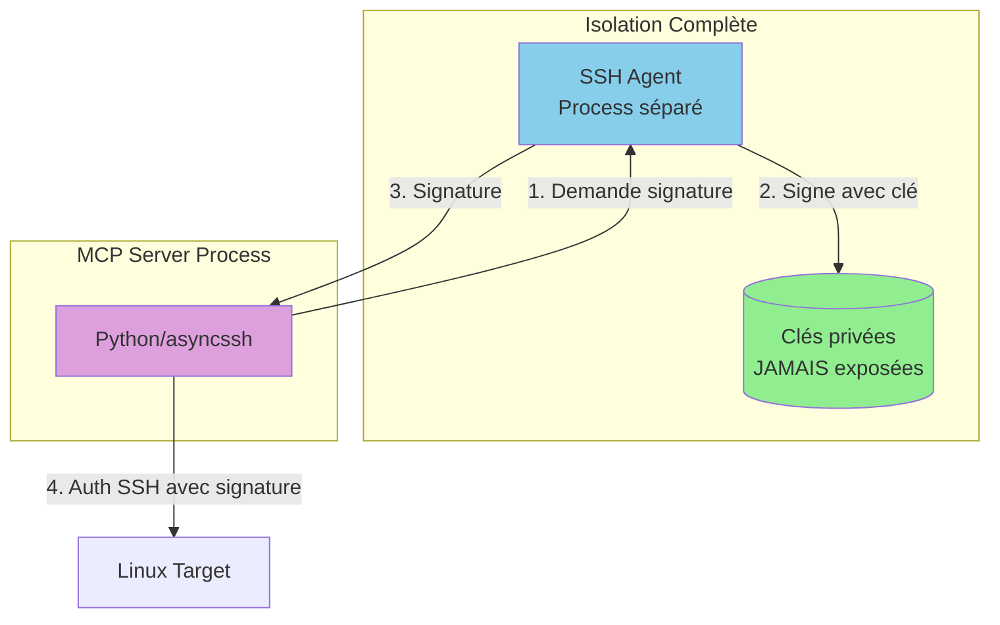
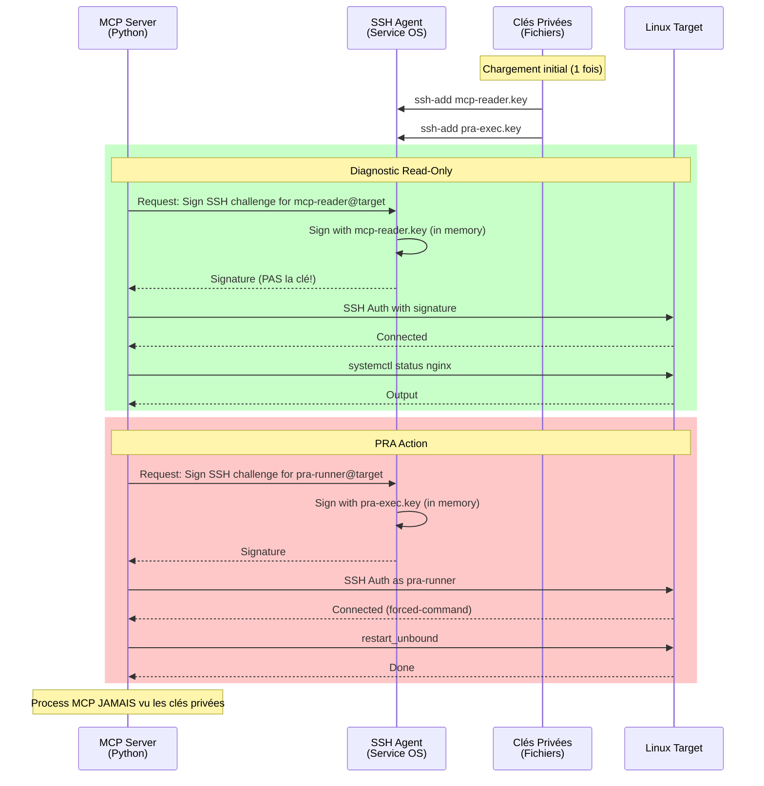
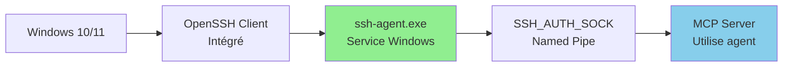
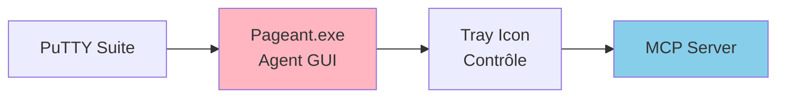
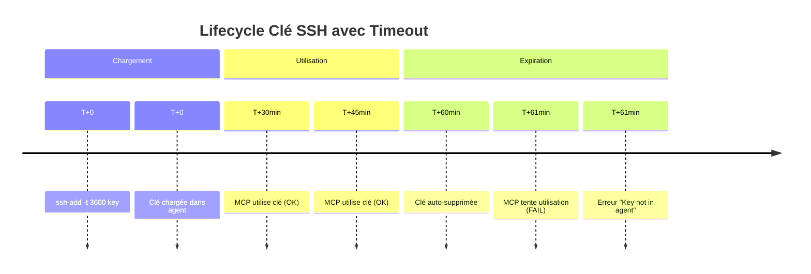
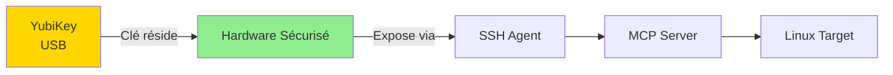
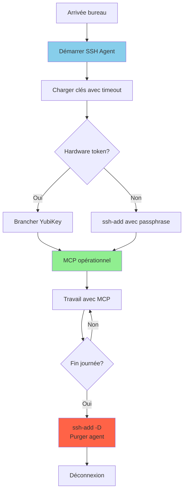
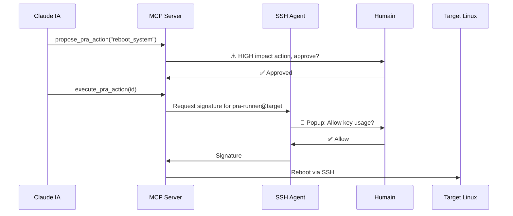

# Sécurité Maximale avec SSH Agent

## Pourquoi SSH Agent ?

### ❌ Approche Classique (moins sécurisée)


**Problèmes:**
- Clé privée en clair dans mémoire du process
- Accessible via dump mémoire
- Logs peuvent contenir fragments
- Compromission process = compromission clé

### ✅ Approche SSH Agent (maximale sécurité)



**Avantages:**

✅ **Clés privées JAMAIS en mémoire MCP**
- Process MCP ne peut jamais accéder aux clés
- Dump mémoire MCP = aucune clé exposée

✅ **IA ne peut JAMAIS voir les clés**
- Aucun tool MCP ne peut lire les clés
- Isolation complète au niveau OS

✅ **Support hardware tokens**
- YubiKey, FIDO2, TPM
- Clés peuvent être sur hardware dédié

✅ **Révocation instantanée**
```bash
ssh-add -D  # Supprime toutes les clés de l'agent
```

✅ **Audit centralisé**
- Toutes les signatures passent par l'agent
- Logs agent = audit trail complet

✅ **Timeout automatique**
```bash
ssh-add -t 3600 key.pem  # Auto-suppression après 1h
```

## Architecture Complète



## Configuration Windows

### Option 1: OpenSSH Agent (Natif Windows 10+)



**Installation:**

```powershell
# Vérifier OpenSSH est installé
Get-WindowsCapability -Online | Where-Object Name -like 'OpenSSH*'

# Si manquant, installer
Add-WindowsCapability -Online -Name OpenSSH.Client~~~~0.0.1.0

# Activer et démarrer le service ssh-agent
Get-Service ssh-agent | Set-Service -StartupType Automatic
Start-Service ssh-agent

# Vérifier
Get-Service ssh-agent
# Status: Running
```

**Charger les clés:**

```powershell
cd D:\infra\mcp-servers\mcp-linux-infra\keys

# Charger clé read-only
ssh-add mcp-reader.key

# Charger clé PRA
ssh-add pra-exec.key

# Vérifier clés chargées
ssh-add -l
# 256 SHA256:abc... mcp-reader@infra (ED25519)
# 256 SHA256:def... pra-runner@infra (ED25519)
```

**Configuration MCP:**

```json
{
  "mcpServers": {
    "linux-infra": {
      "command": "uv",
      "args": ["--directory", "D:\\infra\\mcp-servers\\mcp-linux-infra", "run", "mcp-linux-infra"],
      "env": {
        "LINUX_MCP_USE_SSH_AGENT": "true",
        "LINUX_MCP_LOG_LEVEL": "INFO"
      }
    }
  }
}
```

**Note:** Pas besoin de `SSH_KEY_PATH` quand agent activé !

### Option 2: Pageant (PuTTY/KiTTY)



**Installation:**

1. Télécharger PuTTY: https://www.putty.org/
2. Convertir clés OpenSSH en format PuTTY (.ppk):

```powershell
# Avec PuTTYgen
puttygen.exe mcp-reader.key -o mcp-reader.ppk
puttygen.exe pra-exec.key -o pra-exec.ppk
```

3. Lancer Pageant:
```powershell
& "C:\Program Files\PuTTY\pageant.exe" mcp-reader.ppk pra-exec.ppk
```

4. Vérifier: icône Pageant dans system tray

**Configuration MCP:**

Même config que OpenSSH Agent, `asyncssh` détecte Pageant automatiquement.

### Option 3: GPG Agent (Advanced)

Pour utilisateurs avec GPG/PGP existant:

```bash
# Dans WSL ou Git Bash
export SSH_AUTH_SOCK=$(gpgconf --list-dirs agent-ssh-socket)
ssh-add /path/to/key
```

## Configuration Linux (MCP Server sur Linux)

```bash
# Démarrer ssh-agent
eval $(ssh-agent -s)

# Charger clés
ssh-add /path/to/mcp-reader.key
ssh-add /path/to/pra-exec.key

# Vérifier
ssh-add -l

# Exporter pour MCP
export SSH_AUTH_SOCK=$SSH_AUTH_SOCK

# Lancer MCP
uv run mcp-linux-infra
```

**Systemd service (auto-start):**

```ini
# ~/.config/systemd/user/ssh-agent.service
[Unit]
Description=SSH Agent

[Service]
Type=forking
Environment=SSH_AUTH_SOCK=%t/ssh-agent.socket
ExecStart=/usr/bin/ssh-agent -a $SSH_AUTH_SOCK

[Install]
WantedBy=default.target
```

```bash
systemctl --user enable --now ssh-agent
```

## Sécurité Renforcée

### 1. Timeout Automatique des Clés

```bash
# Clé auto-supprimée après 1 heure
ssh-add -t 3600 mcp-reader.key

# Clé PRA: timeout 30 minutes
ssh-add -t 1800 pra-exec.key
```



### 2. Confirmation Requise

```bash
# Demander confirmation à chaque utilisation (très sécurisé)
ssh-add -c pra-exec.key
```

Quand MCP tente d'utiliser la clé → popup demande confirmation humaine

**Idéal pour actions HIGH impact**

### 3. Hardware Token (YubiKey)



**Setup YubiKey:**

```bash
# Générer clé sur YubiKey (JAMAIS exportable)
ssh-keygen -t ed25519-sk -f ~/.ssh/yubikey_mcp

# Charger dans agent
ssh-add ~/.ssh/yubikey_mcp

# Touch YubiKey requis pour chaque utilisation
```

**Sécurité maximale:**
- Clé JAMAIS sur disque
- Touch physique requis
- Impossible d'extraire la clé

### 4. Separate Agent par Rôle

```bash
# Agent 1: Diagnostics only
export SSH_AUTH_SOCK=/tmp/ssh-agent-readonly.sock
ssh-agent -a $SSH_AUTH_SOCK
ssh-add mcp-reader.key

# Agent 2: PRA only (process séparé)
export SSH_AUTH_SOCK=/tmp/ssh-agent-pra.sock
ssh-agent -a $SSH_AUTH_SOCK
ssh-add pra-exec.key
```

**Isolation process-level complète**

### 5. Audit Agent

```bash
# Linux: SSH Agent avec audit
ssh-agent -D -d  # Debug mode, logs verbeux

# Windows: Event Viewer
# Applications and Services Logs > OpenSSH > Operational
```

**Tracer toutes les signatures:**
- Qui a demandé signature
- Quelle clé utilisée
- Timestamp

## Workflow Production

### Démarrage Journée



**Script démarrage:**

```powershell
# start-mcp-agent.ps1

Write-Host "🔐 Starting SSH Agent for MCP..."

# Start agent
Start-Service ssh-agent

# Load keys with timeout (1 hour)
cd D:\infra\mcp-servers\mcp-linux-infra\keys
ssh-add -t 3600 mcp-reader.key
ssh-add -t 1800 pra-exec.key  # PRA: timeout 30min

# Verify
Write-Host "`n✅ Loaded keys:"
ssh-add -l

Write-Host "`n🚀 MCP Server ready. Keys will auto-expire:"
Write-Host "   - mcp-reader: in 60 minutes"
Write-Host "   - pra-exec: in 30 minutes"
```

**Script arrêt:**

```powershell
# stop-mcp-agent.ps1

Write-Host "🔒 Purging SSH Agent..."

# Remove all keys
ssh-add -D

# Verify
ssh-add -l
# Should show: "The agent has no identities."

Write-Host "✅ All keys removed from agent"
```

### Actions PRA avec Confirmation

**Pour actions MEDIUM/HIGH:**

```bash
# Charger clé PRA avec confirmation obligatoire
ssh-add -c pra-exec.key
```

**Workflow:**



**Double validation:**
1. Approbation action (MCP)
2. Confirmation utilisation clé (Agent)

## Comparaison Approches

| Aspect | Clés Directes | SSH Agent | Agent + Hardware |
|--------|---------------|-----------|------------------|
| Clé en mémoire MCP | ❌ Oui | ✅ Non | ✅ Non |
| IA peut voir clé | ❌ Possible | ✅ Impossible | ✅ Impossible |
| Révocation | 🟡 Redémarrer MCP | ✅ ssh-add -D | ✅ Débrancher token |
| Timeout auto | ❌ Non | ✅ Oui | ✅ Oui |
| Confirmation requise | ❌ Non | ✅ Optionnel | ✅ Touch physique |
| Audit centralisé | 🟡 Logs MCP | ✅ Logs agent | ✅ Logs agent + hardware |
| Setup complexité | ✅ Simple | 🟡 Moyen | ❌ Complexe |
| Coût | ✅ Gratuit | ✅ Gratuit | 🟡 ~$50 (YubiKey) |

**Recommandation:**

- **Dev/Test:** Clés directes OK (convenience)
- **Production:** SSH Agent **OBLIGATOIRE**
- **Haute Sécurité:** Agent + Hardware token

## Migration Clés Directes → Agent

### Étape 1: Préparer Agent

```powershell
# Activer service
Set-Service ssh-agent -StartupType Automatic
Start-Service ssh-agent

# Vérifier
Get-Service ssh-agent
```

### Étape 2: Charger Clés

```powershell
cd D:\infra\mcp-servers\mcp-linux-infra\keys
ssh-add mcp-reader.key
ssh-add pra-exec.key
ssh-add -l  # Verify
```

### Étape 3: Modifier Config MCP

```diff
# .env
- LINUX_MCP_SSH_KEY_PATH=D:/infra/.../mcp-reader.key
- LINUX_MCP_PRA_KEY_PATH=D:/infra/.../pra-exec.key
+ LINUX_MCP_USE_SSH_AGENT=true
```

```diff
# claude_desktop_config.json
  "env": {
-   "LINUX_MCP_SSH_KEY_PATH": "D:\\infra\\...\\mcp-reader.key",
-   "LINUX_MCP_PRA_KEY_PATH": "D:\\infra\\...\\pra-exec.key",
+   "LINUX_MCP_USE_SSH_AGENT": "true",
    "LINUX_MCP_LOG_LEVEL": "INFO"
  }
```

### Étape 4: Mettre à Jour Code

```python
# connection/__init__.py

from .ssh_agent import (
    execute_command_via_agent as execute_command,
    execute_pra_action_via_agent as execute_pra_action,
)
```

### Étape 5: Tester

```python
# Test read-only
get_system_info(host="web01.infra")

# Test PRA
propose_pra_action("restart_unbound", host="web01.infra", auto_approve=True)
execute_pra_action(action_id="...")
```

### Étape 6: Vérifier Sécurité

```powershell
# Clés NOT en mémoire MCP
$mcp_pid = Get-Process -Name "uv" | Select-Object -ExpandProperty Id
Get-Process -Id $mcp_pid | Format-List *

# Dump mémoire (test) - ne doit PAS contenir clé privée
# procdump.exe -ma $mcp_pid dump.dmp
# strings dump.dmp | grep "BEGIN.*PRIVATE KEY"
# Résultat attendu: RIEN
```

## Troubleshooting

### Problème: "SSH Agent not available"

```powershell
# Vérifier service
Get-Service ssh-agent

# Si stopped
Start-Service ssh-agent

# Vérifier variable environnement
$env:SSH_AUTH_SOCK
```

### Problème: "Key not found in agent"

```powershell
# Lister clés chargées
ssh-add -l

# Si vide, charger
ssh-add D:\infra\...\mcp-reader.key
ssh-add D:\infra\...\pra-exec.key
```

### Problème: "Permission denied (publickey)"

```bash
# Sur target Linux
# Vérifier authorized_keys contient la bonne clé publique
cat ~/.ssh/authorized_keys

# Comparer avec clé dans agent
ssh-add -L  # Affiche clés publiques
```

### Problème: Timeout expiré

```powershell
# Recharger avec nouveau timeout
ssh-add -t 3600 mcp-reader.key
```

## Références

- [OpenSSH Agent Forwarding](https://www.ssh.com/academy/ssh/agent)
- [YubiKey SSH Guide](https://developers.yubico.com/SSH/)
- [Windows OpenSSH](https://docs.microsoft.com/en-us/windows-server/administration/openssh/openssh_install_firstuse)
- [asyncssh Agent Support](https://asyncssh.readthedocs.io/en/latest/api.html#agent-support)
